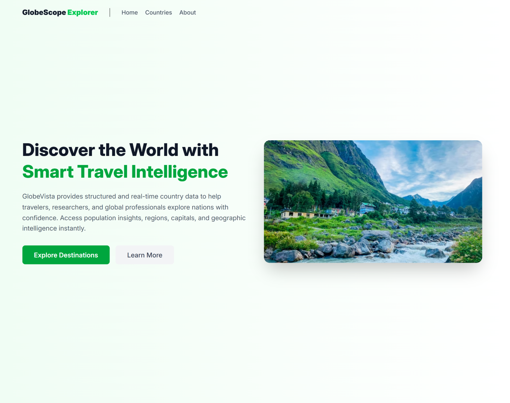
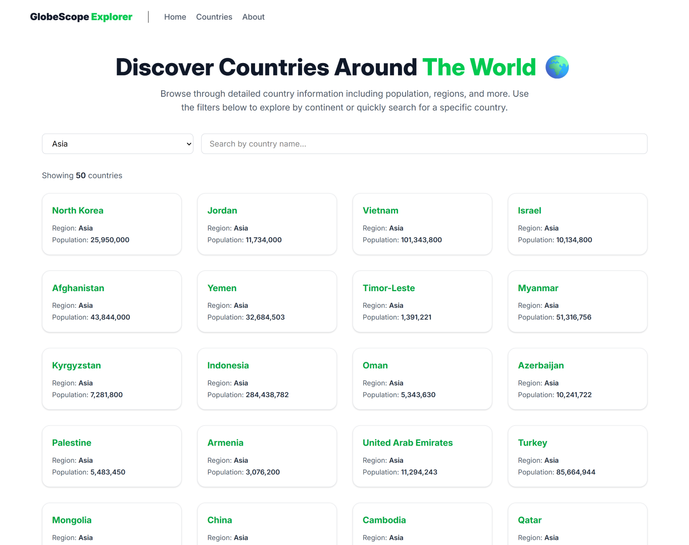
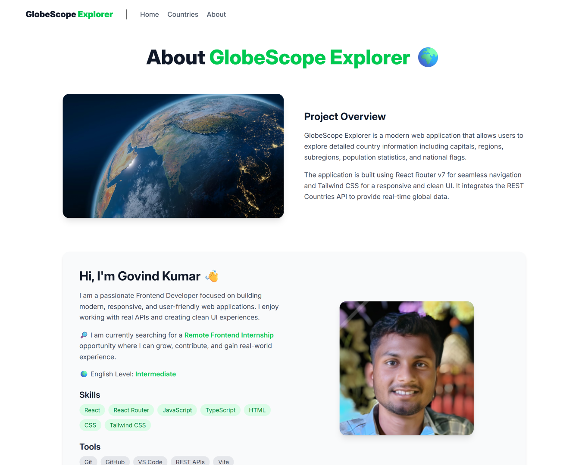
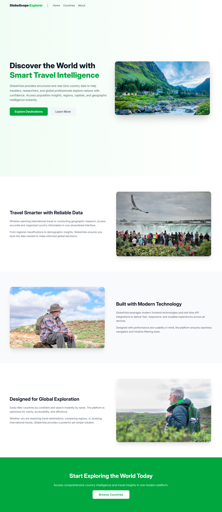

# 🌍 Globe Scope Explorer

<p align="center">
  
</p>

<p align="center">
A modern <b>Country Explorer Web App</b> built with <b>React</b> and <b>Vite</b>.  
Search countries and explore detailed information like population, region, capital, and flags.
</p>

---

## 🚀 Features

✨ Modern and fast country explorer

* 🔍 Search countries by name
* 🌎 View detailed information for each country
* 🧭 Dynamic routing for country pages
* ⚡ Fast development with Vite
* 🎨 Clean and responsive UI
* 📡 Real-time data from REST Countries API

---

## 🛠 Tech Stack

| Technology   | Purpose         |
| ------------ | --------------- |
| React        | UI Library      |
| React Router | Routing         |
| Vite         | Fast build tool |
| TypeScript   | Type safety     |
| CSS          | Styling         |

---

## 📦 Installation

Clone the repository:

```bash
git clone https://github.com/govindsha7630/GlobeScope-Explorer.git
cd GlobeScope-Explorer
```

Install dependencies:

```bash
npm install
```

---

## ▶️ Run the Project

Start the development server:

```bash
npm run dev
```

Open in browser:

```
http://localhost:5173
```

---

## 🌐 API Used

This project fetches data from **REST Countries API**.

Example request:

```
https://restcountries.com/v3.1/name/${encodeURIComponent(countryName)}?fullText=true&fields=name,capital,population,region,subregion,flags
```

---

# 📸 Screenshots

## 🏠 Home Page

<p align="center">
  
</p>

---

## 🌎 Countries Page

<p align="center">
  
</p>

---

## ℹ️ About Page

<p align="center">
  
</p>

---

## 🖥 Full Page Preview

<p align="center">
  
</p>

---

## 📁 Project Structure

```
src
 ├── components
 │   └── Navbar.tsx
 │
 ├── routes
 │   ├── home.tsx
 │   ├── countries.tsx
 │   ├── country.tsx
 │   └── about.tsx
 │
 ├── root.tsx
 └── routes.tsx
```

---

## 🔗 Routing Example

Dynamic routing example:

```
/country/:countryName
```

Example URL:

```
/country/india
```

---

## 🎯 What I Learned

While building this project I practiced:

* Component-based architecture
* Dynamic routing
* Fetching API data
* Handling loading states
* Building responsive UI layouts

---

## 📌 Future Improvements

Planned features:

* 🌙 Dark / Light mode
* 🌍 Region filtering
* ⭐ Favorite countries
* ⚡ Better animations
* 📱 Improved mobile UI

---

## 🤝 Contributing

Contributions are welcome!

1. Fork the repository
2. Create a new branch
3. Make your changes
4. Submit a pull request

---

## 👨‍💻 Author

**Govind Shah**

If you like this project, consider giving it a ⭐ on GitHub!
